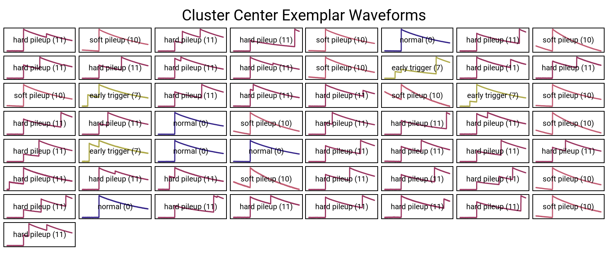

# Quality Cuts with Machine Learning: AP-SVM

This ML quality cut implementation is based on the strategy developed by Esteban León: 🐙 [AP-SVM-Data-Cleaning](https://github.com/esleon97/AP-SVM-Data-Cleaning/tree/main/train), 📖 [Publication](https://iopscience.iop.org/article/10.1088/2632-2153/adbb37)

In the first part, this documentgives an overview of the AP-SVM strategy. The the second part, the code workflow is explained. 

The ML-based quality cuts follow a two-step approach:
1. **Affinity Propagation (AP)** 
2. **Support Vector Machine (SVM)**  

> ⚠️ **Note on Automation:**   
> The machine learning-based quality cuts aren't fully automated. Unlike other processing steps (e.g. DSP, energy calibration), automation is not possible due to the requirement for **manual relabeling** of exemplars (see step 1.2 and `03_AP_relabel.jl`).  Therefore, the ML quality cuts are provided as standalone scripts that must be **manually adapted** to suit your specific use case.

# Strategy
## 1. Affinity Propagation (AP)
- AP is an unsupervised clustering algorithm used to group similar waveforms.
- Goal: Cluster waveforms into groups based on waveform type.
- AP performs three key tasks:
  1. **Determines** the number of clusters present in the data.
  2. **Identifies** exemplars — representative waveforms for each cluster.
  3. **Assigns** each waveform a label, referred to as the **AP label** (an integer between 1 and *n_clusters*).

> Due to its high memory usage, AP is applied only to a subset of the data (typically ≤ 10,000 waveforms).

### 1.1 Hyperparameter optmization
Affinity propagation has two hyperparameters: the **preference** and the **damping**. 

- preference
  - Controls how likely a data point is to be chosen as a cluster center (exemplar).
  - Lower values (more negative) → fewer clusters
  - Higher values (less negative) → more clusters
  - default: median of similarity matrix
- damping
  - A factor used to control the update rate during the clustering process.
  - Helps stabilize the iterative message-passing algorithm and avoid oscillations.
  - Must be set between `0.5` and `< 1.0`.
  - Lower values (closer to 0.5) → faster updates, but can lead to instability
  - Higher values (closer to 1.0) → more stable, but slower convergence

Our goal is to optimize the hyperparameters with respect to cluster size (and convergence). The want to have around 100 clusters, and the algorithm should of course converge within a reasonable time. Less clusters would not capture the diversity of waveforms and more clusters would be infeasible to relabel by hand (see next step).

This figure shows an example of AP hyperparameter optimization. In case the AP didn't converge for a (preference, damping)-configuration, the grid point is colored grey. 

<figure>
    
    <figcaption><b>Figure 1:</b> AP-hyperparameter optimization</figcaption>
</figure>

### 1.2 AP apply to training set and assign qc-labels. 
Now we run AP with the optimial (or guessed) hyperparameters. 

The resulting clusters are initially labeled with arbitrary numeric IDs (e.g., 1 to *n_clusters*), that we refer to as *"AP labels"*. 

In a **manual** post-processing step, we map these numeric **AP labels** to meaningful **quality control (QC) labels** using a predefined legend.

| QC Label | Description   |
| -------- | ------------- |
| 0        | normal        |
| 1        | neg. going    |
| 2        | up slope      |
| 3        | down slope    |
| 4        | spike         |
| 5        | x-talk        |
| 6        | slope rising  |
| 7        | early trigger |
| 8        | late trigger  |
| 9        | saturated     |
| 10       | soft pileup   |
| 11       | hard pileup   |
| 12       | bump          |
| 13       | noise         |

<figure>
    
    <figcaption><b>Figure 2:</b> Exemplars with AP-labels</figcaption>
</figure>

<figure>
    
    <figcaption><b>Figure 3:</b> Exemplars with QC-labels</figcaption>
</figure>

**Figure 3.2:** *Exemplars with QC-labels*

## 2. Support Vector Machine (SVM)

SVM is a supervised learning algorithm. We train the SVM on the same waveforms used for AP, using the QC labels assigned in the previous step.

Once trained, the SVM model can predict QC labels for new, unseen waveforms—effectively scaling the AP-based classification to larger datasets.
<figure>
    
    <figcaption><b>Figure 4:</b> Example of QC-labels obtained from AP-SVM model on training data set</figcaption>
</figure>

# AP-SVM Workflow Scripts

The following scripts implement the AP-SVM quality cut workflow:

1. **`01_AP_hyperpars_opt.jl`**  
    - Runs the Affinity Propagation (AP) model over a grid of hyperparameter combinations to find best combination.  
    - This script will output a report, which summarizes the number of clusters for each grid point. 
    - For the next step, select a (perference, damping)-combination that results in approximately `100` clusters.

    Since this step is the most computational expensive one, it should be run via a SLURM script on a computing cluster (bash script might need modifications for your cluster specs): 

    > `sbatch run_AP_opt.sh` 

    For first tests, you can also skip this step and just guess a hyperparameter combination. 

2.  **`02_AP_train.jl`**  
  Runs the AP clustering algorithm and saves intermediate results, including:
    - AP labels for each waveform
    - Indices of cluster centers (waveforms)

    In case you use many waveforms (> 1,000) for AP training, it might be handy run the script in batch mode:
    > `sbatch run_AP_train.sh` 

3.  **`03_AP_relabel.jl`**  
    - Performs **manual** relabeling of cluster centers, mapping AP labels to meaningful QC labels.  
    - Saves the updated AP results.

4. **`04_SVM.jl`**  
    - Trains and evaluates the Support Vector Machine (SVM) model.  
    - The waveforms used in AP are split into training and test sets.  
    - The script validates the classification performance of the SVM. Save SVM results.

4. **`05_Apply_AP-SVM.jl`**  
    - Applies the trained AP-SVM model to unseen data, such as all waveforms from a full run.

> ⚠️ **Note:** SVM hyperparameters are currently not optimized.  
> Future improvements should include hyperparameter tuning to enhance model performance.
